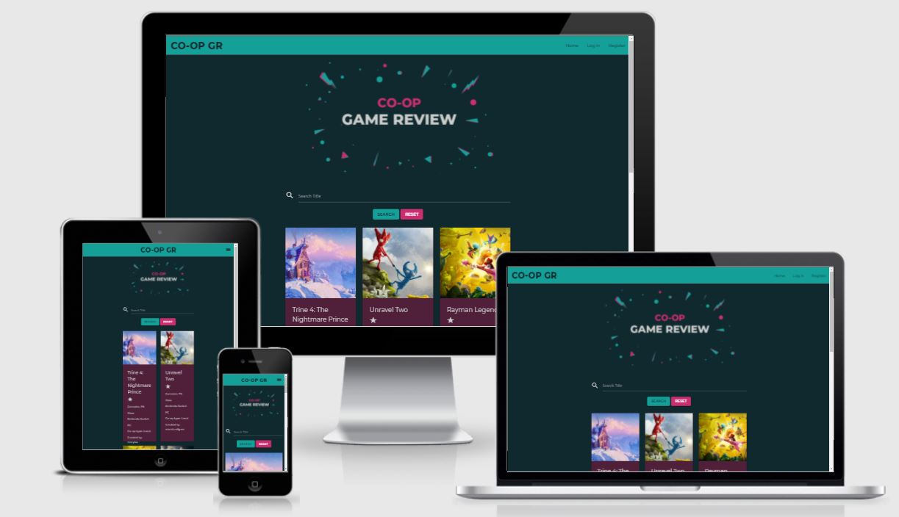
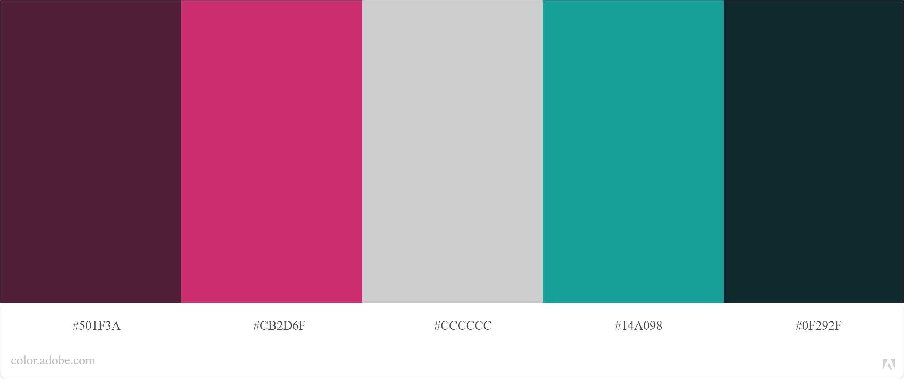

# CO-OP Game Review

Co-op Game Review is a community based website where users can share game titles and reviews of co-op games with eachother. The website is created educational purposes only.

# UX

## Strategy

The purpose of this website is to create a community-based review site for co-op videogames where people can share their experiences and thoughts on videogames that they have played. The target audience is people who want help with deciding what the next co-op game they should to play or just are interested in sharing and reading others reviews of co-op games. 

## Scope

Site owners’ goal: To create a community where people who have a common interest for playing co-op videogames can share reviews and experiences playing different games with each other. In the future the site owner could also be making money on the site if it becomes big enough that they can advertise games on the site and have add-links to places where you can purchase the videogames. 

User’s goal: To share their own experiences playing coop videogames and take part of other people’s experiences.

### User stories 

As an anonymous user 
-	I want to be able to register to join the community.
-	I want to be able to see the reviews and titles that others have posted.
-	I want to be able to search amongst the posts if I am looking for something specific.
-   I want to be able to find the website's social channels.

As a registered user 
- I want to be able to log in to my account.
-	I want to be able write my own game reviews. 
-	I want to be able to delete my own game reviews.  
-	I want to be able to edit game reviews that I have already posted.  
-	I want to be able to add an image and information to my profile. 
-	I want to be able to add a new game title. 
-	I want to be able to delete a game title that I have added, including the reviews added to that title. 
-	I want to be able to edit a game title that I have added. 
-	I should not be able to edit the game titles or reviews that others have shared. 

## Structure

Since the main purpose of this website is for people to share can take part of each other reviews playing coop videogames this is the most important part of the website and everything else implemented on the website it there to support this function. This make the reviews the most important content on the website also so they will be easy to access even before signing up to the website as a user. 

## Skeleton

Figma was used to create wireframes that are linked below.

- [Desktop](static/wireframes/desktop-wireframes.pdf)
- [Desktop when logged in](static/wireframes/desktop-wireframes-logged-in.pdf) 
- [Tablet](static/wireframes/tablet-wireframes.pdf) 
- [Tablet when logged in](static/wireframes/tablet-wireframes-logged-in.pdf) 
- [Mobile](static/wireframes/mobile-wireframes.pdf) 
- [Mobile when logged in](static/wireframes/mobile-wireframes-logged-in.pdf)

## Surface 

### Colors

The colors choosen for this project are choosen to create a visual intrest with a dark background and stronger colors used on elements that should be highlighted. 

### Typography
The fonts choosen for the project are found on Google Fonts. Montrerrat are used for the headings in the project and Raleway are used for the body text, these were suggested as a popular paring by Google Fonts. The fallback font for both fonts is Sans-Serif. 

# Database structure

The database was stroed in three different collections users, titles and reviews, shown below. the collections all have relations between the, the reviews and titles and connected by the created_by which is the session user that creates the title or review, this connection is made so that it is able to check if the review or title are created by the user if the user wants to dele or edit a game title or reviews so that onely the user that created it can do that and not the other users. This is also done so that the user can see all the reviews and titles that they have added on their profile page. 

The reviews are connected to the game titles by the title_id which is added to the review when created. This connection is done to be able to show all the reviews that belond to a specific game title om the selected game title template. This connection also made the function to delete all the reviews that belongs to a specific game title if that title is removed and to be able to calculate the avrage rating of a game title from the reviews that belongs to that specific title. 

| Users | |
| ------ | ------ |
| _id | ObjectId |
| username | string |
| email | string |
| password | string |
| favourite_game | string |
| profile_image_url | string |

| Titles | |
| ------ | ------ |
| _id | ObjectId |
| title_name | string |
| image_url | string |
| description | string |
| consoles | array |
| co_op_type | array |
| created_by | string |

| Reviews | |
| ------ | ------ |
| _id | ObjectId |
| title_id | string |
| review | string |
| rating | int32 |
| created_by | string |

# Features 

## Existing features

- Navbar 
    - The navbar contains links to navigate to different parts of the website and the logo. The navbar is sticky so that the user always easily can navigate to different parts of the webpage.
    - As an anonymous user you will have access to the pages Home, Log In and Resgister in the navbar. 
    - As a regitstered user logged in to your account you will have access to the pages Home, Profile, New Game Title, and Log Out in the nabar.
- Footer 
    - The footer contains links to social media and the logo. 
- Home page 
    - Navbar (described under navbar) 
    - The homepage contains a hero image underneath the navbar. 
    - Below the hero image it is a search field so that the user immediately can start searching amongst the game titles on the website and see their reviews.
    - Underneath the search field are the game titles presented. Clicking on a game title takes the user to the selected game title page for that specific game title. 
    - Footer (described under footer) 
- Selected game title 
    - Navbar (described under navbar) 
    - The selected game title page contains a card with an image of the selected game title and all the information avalible on that title.
    - If the user are a registred user that are logged in to their account there is also a add review button on the game title where the user can add their own review to that specific game title. 
    - Underneath the game title all the reviews to that specific game title are presented.
- Log In page
    - Navbar (described under navbar) 
    - The log in page contains a field for filling in your username and password and a button to log in to your account as a registered user.
    If the user inputs correct username and password of an existing user this brings the user to their profile page with the flash message "Welcome, username"shown. 
    If the user trys to log in with either the wrong password or username the flash message "Incorrect username and/or password" appears.
    - Footer (described under footer) 
- Register page
    - Navbar (described under navbar) 
    - The register page will contain a field for filling in your Username, email address, password and a button to register as a user on the webpage. 
    - Footer (described under footer)
- Profile page 
    - Navbar (described under navbar) 
    - On the profile page the user can see the information they have added to their profile.
    - Underneath the profile area the user can see all the titles and reviews that they have added to the website and can edit or delete them.  
    - Footer (described under footer)
- Edit profile page 
    - Navbar (described under navbar) 
    - On the edit profile page the user can change their profile, they can add a profile image and their favorite game. 
    - Footer (described under footer)
- New review page
    - Navbar (described under navbar) 
    - This page contains the function to add a new review to a title. The user writes their review and their rating and then they can submit the review to the website on the submit button. 
    - Footer (described under footer) 
- Edit review page
    - Navbar (described under navbar)
    - This page contains the function to edit a review that the user has previously added to a game title. The current review and rating are already filled in on this page and the user can make the canges and then save the changes on the edit review button. 
    - Footer (described under footer)
- New Title page 
    - Navbar (described under navbar) 
    - The new title page contains the function to add a new game title to the webpage. The user fills out the title of the game, adds a URL to an image, a description of the game, the console it is available on, and if you can play it local, online or both and then they can submit the new title to the webpage on the submit button. 
    - Footer (described under footer) 

## Features left to implement

# Technologies Used 

- [HTML5](https://en.wikipedia.org/wiki/HTML5) used to make the structure of the website.
- [CSS3](https://en.wikipedia.org/wiki/CSS) used to add style to the project. 
- [Python3](https://www.python.org/) 
- [JQuery](https://jquery.com/)
- [Jinja](https://jinja.palletsprojects.com/en/3.0.x/)
- [PyMongo]() 
- [Flask](https://flask.palletsprojects.com/en/2.0.x/) 
- [MongoDB](https://www.mongodb.com/) used to host the database.
- [Heroku](https://www.heroku.com/) used to deply live website. 
- [Werkzeug](https://werkzeug.palletsprojects.com/en/2.0.x/)
- [Materialize](https://materializecss.com/) used to style certain elements and to make the website responsive. 
- [Font Awesome](https://fontawesome.com/) used for the icons in the footer. 
- [Google Fonts](https://fonts.google.com/) was used to import the fonts used in the project. 
- [Gitpod](https://www.gitpod.io/) used to develop the project. 
- [Github](https://github.com/) used to store the project. 
- [Figma](https://www.figma.com/) used to make wireframes for the project.  
- [Illustrator](https://www.adobe.com/products/illustrator.html) used to make some changes in the hero image. 
- [RandomKeyGen](https://randomkeygen.com/) to generate the SECRET KEY.  

# Testing

For lenth reasons the testing part is in a sepeate document. Click [here](TESTING.md) to go to the testing document.

# Deployment

## Deploy 

Start with seting up the files that heroku needs to run the application. In your terminal write: 
- `pip3 freeze --local > requirements.txt`
- `eco web: python app.py > Procfile`
- `git add requirements.txt`
- `git commit -m "Added requirements.txt"`
- `git add Procfile`
- `git commit -m "Added Procfile"`
- `git push`

Create a new app on heroku. 
- Create an account on Heroku if you don't have one. 
- Log in to your Heroku account and to the right on the screen and choose **Create New App**.
- Fill in a unique name in the app name text field. 
- Choose the region closest to you in the choose a region dropdown list. 
- Click on **Create App**. 

Set up automatic deplyment from your GitHub repository. 
- On your heroku app under the deploy tap click on **Connect To GitHub**. 
- Make sure your hitHub profile is displayed. 
- Add the name of the GitHub repository in the search field and click on **Search**. 
- When your reposity has been found click on **Connect**. 

Add your environment variables to heroku. 
- Still in your keroku app click on the setting tab. 
- And then click on **Reveal Config Vars**.
- Now you fill in the information from your env.py file. Fill in the IP, PORT, SECRET_KEY, MONGO_URI and MONGO_DBNAME. 

Now go back to heroku to enable deplyment. 
- In you heroku app under the deply tap click on **Enable Automatic Deploys**. 
- And then choose the master branch and click on **Deploy Branch**. 
- Now heroku will receive the code from GitHub and start bulding the app, this can take a few minutes to build. 
- When it is done you see the message "Your app was successfully deployed."
- Beneath the success message click on **View** to launch your new app.
- Now your deplyed site is avalible and will update when you push changes to the GitHub repository. 

## Run code locally

- Find the repository you want and click on it.
- Above all the files in the repository click on the green Gitpod button.
- This opens a new copy of the workspace on Gitpod. You should only do this once and then you can access the workspace directly from Gitpod. If you press the green Gitpod button again it will create a new copy of the workspace on Gitpod.
- You can now edit the workspace locally.
- If you want to open a preview window of the workspace in the browser you can type in the command: `python3 app.py` in the terminal and then click open browser in the pop-up window down to the right.

# Credits 

## Code 

- In this project I have used the Code Institute Educational material for the fondation and then bult my own code upon that, [Tim Nelson's Flask Task Manager Project](https://github.com/TravelTimN/flask-task-manager-project/tree/demo) The login, registration and log out function is completely taken from this. I have also taken the form validation for Materialize forms from this material.
-  I have used [Materialize](https://materializecss.com/) in this project to make the website responsive and to style objects, and then i have customized the components used to fit my project. I have used materialize for the following:
    - For the navbar and mobile side nav. 
    - For the footer and css code to body and main to make the footer always stay at the bottom of the page. 
    - For the cards that holds game titles and reviews. 
    - For all the forms, to add edit, register and login. 
    - For the modals when clicking on a delete button. 
    - For buttons.
    - For most of the icons.
- I used [this](https://www.makeschool.com/mediabook/oa/tutorials/playlistr-video-playlists-with-flask-and-mongodb-1c/adding-route-for-comments/) tutorial to better understand how to assosciate a review with a specific game title through the title_id. It is from this that i got the idea to make a hidden form field that adds the title_id to the review when it's created to make a connection between the review and game title.
- In [this](https://stackoverflow.com/questions/12196885/text-flowing-out-of-div) thred on Stack Overflow I found this `overflow-wrap: break-word;` that is added to the cards holding the game titles and reviews so that the text don't go outside the card if someone adds in a log text with no spaces in it. 
- In [this](https://stackoverflow.com/questions/46144767/how-to-format-a-float-number-in-python-flask-and-jinja) thred on Stack Overflow I found how to format my average rating on the game titles card so that it rounds the number to one decimal.  
- I used [this](https://www.youtube.com/watch?v=Kk6Er0c7srU) YouTube video to understand aggregation and grouping to be able to calculate the avrage ratings for the game titles from the reviews. 

## Media 

- Hero image from [freepik](https://www.freepik.com/vectors/banner) created by freepik.
- Image used for 404 and 500 error page from [freepik](https://www.freepik.com/vectors/background) created by freepik.

Images for game titles added: 
- Image for Rayman Legends taken from flickr by [Jorge Figueroa](https://www.flickr.com/photos/jiff01/10936113976/in/photostream/), link to [license](https://creativecommons.org/licenses/by/2.0/legalcode).
- Image for Unravel 2 taken from flickr by [PlayStation Europe](https://www.flickr.com/photos/playstationblogeurope/41739937825/in/photostream/), link to [license](https://creativecommons.org/licenses/by-nc/2.0/legalcode).
- Image for A Way Out taken from flickr by [BagoGames](https://www.flickr.com/photos/bagogames/27157402518), link to [license](https://creativecommons.org/licenses/by/2.0/legalcode)

## Acknowledgements 