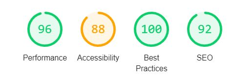
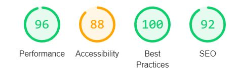
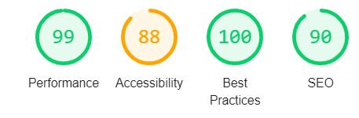

# Testing 

## Validation 

- To test the HTML the [W3C Markup Validation Service](https://validator.w3.org/) was used.
    - The HTML validator showed no errors or warnings. 

    

- To test the CSS the [W3C CSS Validation Service](https://jigsaw.w3.org/css-validator/) was used. 
    - The CSS validator showed no errors or warnings.

    
- To test JQuery [JSHint](https://jshint.com/) was used. 
    - JSHint showed no errors or warnings. 

    

- [Pylint](https://www.pylint.org/) was used to test the Python code.
    - I have one error in Pylint, see below, but this is because I technically using the variable in the code but I use the code above to get the variables from it, 
    so the code works as expected and this error will be ignored.

    

## Features 

Below the user stories testing, manual testing and testing of the added security is presented. 

### Navbar

#### Manual testing of Navbar

- Clicking on the logo reloads the homepage. 
- Clicking on the home link reloads the homepage. 
- Clicking on the Log In link brings the user to Log In page.
- Clicking on the Register link brings the user to the Register page. 
- Clicking on the Profile link brings the user to the Profile page. 
- Clicking on the New Game Title link brings the user to the Add Game Title page. 
- Clicking on the Log Out link removes the user from the session cookie and brings the user to Log In page. 
- Hovering over the links to make sure they become darker when hovering over them. 
- Scrolling down the page the navbar stays at the top of the browser window.
- This was repeated on all pages to make sure the navbar works on every page.

### Footer 

#### User stories testing Footer

- I want to be able to find the website's social channels.
    - In the footer, there are links to the website's social media channels.

#### Manual testing of Footer

- Clicking the Facebook icon brings the user to facebook.com in a new browser window.
- Clicking the Instagram icon brings the user to instagram.com in a new browser window.
- Hovering over the contact link and social icons to make sure they become lighter when hovering over them.
- This was repeated on all pages to make sure the footer works on every page.

### Home

#### User stories testing Home 

- I want to be able to search amongst the posts if I am looking for something specific.
    - On the homepage, the user can search among the titles for a specific game title.

#### Manual testing of Home

- Hovering over the cards with game titles on to make sure the hover effect works. 
- Searching for an existing game title and I get that game title displaying underneath the search field.
Also tested to search in all lower and uppercase to see that this also works, and this also displays the game title.
-  Searching for a title that doesn't exist in the DB and this shows the text "couldn't find game title", as expected. 
- Clicking on the reset button after a search and this shows all the added game titles again, as expected. 
- Clicking on the card of a game title brings me to the selected game title page of that specific title.

### Selected Game Title

#### User stories testing Selected Game Title

- I want to be able to see the reviews and titles that others have posted.
    - On the selected game title page the user can see all the available  information about the selected game title. 
    Underneath the game title the user can also see all the reviews that have been added to that specific game title.

#### Manual testing of Selected Game Title

- Visit the selected game title page as an anonymous user to make sure the add game title button or edit and delete button isn't appearing.
- Visit the selected game title page as a registered user logged in to their account and make sure that the edit and delete buttons only appear on the reviews created by the session user.
- Visit the selected game title page as a registered user logged in to their account and clicking on the delete button to one of the reviews created by the session user and the modal appears. 
    - Clicking on the cancel button on the modal and the review isn't being deleted. 
    - Clicking on the delete button on the modal and the review is deleted and the flash message "review deleted" appears. 
- Visit the selected game title page as a registered user logged in to their account and clicking on the edit button to one of the reviews created by the session user and this takes the user to the edit review page of that review.
- Visit the site as a registered user that is logged in to their account and the add a review button is visible. 
- Hovering over add review button to make sure it becomes lighter when hovering over.
- Clicking on add review button and this brings the user to the add review page.

### Log In

#### User stories testing Log In

- I want to be able to log in to my account.
    - On the Log In page, the user can Log In to their account with their username and password. 

#### Manual testing of Log In

- Trying to log in without filling out the username field and a message appears to fill out this field.
- Trying to log in with the wrong username and the flash message "Incorrect username and/or password" appears.
- Trying to log in without filling out the password field and a message appears to fill out this field.
- Trying to log in with the wrong password and the flash message "Incorrect username and/or password" appears.
- Trying to log in with the wrong username and the wrong password the the flash message "Incorrect username and/or password" appears.
- Trying to log in with an existing user and correct password and this brings the user to the profile page of this user,
and shows flash message "Welcome, username". 

### Register

#### User stories testing Register

- I want to be able to register to join the community.
    - On the register page, an anonymous user can register by adding a username, email address, and password to get an account and become a registered user.

#### Manual testing of Register

- Trying to register without filling out the username field and a message appears to fill out this field.
- Trying to register a username with less than 5 characters and a message appears that the username must match the requested format. 
- Trying to register a username with more than 15 characters and the form won't let me fill in more than 15 characters. 
- Trying to register a username with a character that is not allowed and a message appears that the username must match the requested format. 
- Trying to register without filling out the email field and a message appears to fill out this field.
- Trying to register without filling out the password field and a message appears to fill out this field.
- Trying to register a password with less than 5 characters and a message appears that the username must match the requested format.
- Trying to register a password with more than 15 characters and the form won't let me fill in more than 15 characters. 
- Trying to register a password with a character that is not allowed and a message appears that the username must match the requested format. 
- Trying to register a user with a username that already exists in the db and flash message "Username already exist. Please choose another username." appears. 
- Trying to register with all the forms filled out correctly and the user gets redirect to their profile page with the flash message "Registration Successful" showing, and the user gets added to the users collection in mongodb. 

### Profile

#### User stories testing Profile

- I want to be able to delete my own game reviews.  
    - On the user's profile page they can see all the reviews that the user has added. 
    On each review, there is a delete button that the user can click on if they want to delete that specific review.
- I want to be able to delete a game title that I have added, including the reviews added to that title. 
    - On the user's profile page they can see all the game titles that the user has added. 
    On each game title, there is a delete button that the user can click on if they want to delete that specific title,
    the user will also delete all the reviews that have been added to that game title even if added by another user.

#### Manual testing of Profile

- Hovering over the edit profile button to make sure it becomes lighter when hovering over.
- Clicking on the edit profile button and this takes the user to the edit profile page.
- Hovering over delete buttons on reviews and game titles to make sure it becomes lighter when hovering over.
- Clicking on the delete button to one of the reviews and the modal appears. 
    - Clicking on the cancel button on the modal and the review isn't being deleted. 
    - Clicking on the delete button on the modal and the review is deleted and the flash message "review deleted" appears. 
- Clicking on the delete button to one of the game titles and the modal appears. 
    - Clicking on the cancel button on the modal and the title isn't being deleted. 
    - Clicking on the delete button on the modal and the title is deleted and flash message "title deleted" appears. 
- Hovering over edit buttons on reviews and game titles to make sure it becomes lighter when hovering over.
- Clicking on the edit button on review and this takes the user to the edit review page of that review. 
- Clicking on the edit button on the game title and this takes the user to the edit title page of that title.
- Clicking on the card of a game title brings me to the selected game title page of that specific title.
- Saving the URL for a logged-in user's profile page and tries to access it after logging out and this redirects the user to the log in page.
- Saving the URL for a logged-in users profile page and tries to access it after logging in as a different user and this brings the user to their own profile page.

### Edit Profile

#### User stories testing Edit Profile

- I want to be able to add an image and information to my profile.
    - On the edit profile page, the user can edit their profile, the user can add/edit their profile image
    and edd/edit what their favorite game is. 

#### Manual testing of Edit Profile
- Try to add an image in the input field for the image URL and clicking on the edit profile button.
This brings the user back to the profile back, an image is shown on the profile, flash message "Profile Updated" appears,
and the image URL is stored on the user in the db. 
- Tries to add more than 30 characters in the favorite game input field and the field won't let me put in more than 30 characters. 
- Try to add a favorite game in the input field for favorite game and clicking on edit profile.
This brings the user back to the profile back, a favorite game is shown on the profile, flash message "Profile Updated" appears,
and the favorite game is stored on the user in the db. 
- Saving the URL for the edit profile page and tries to access it after logging out and this redirects the user to the log in page.
- Saving the URL for the edit profile page and tries to access it after logging in as a different user and this brings the user to their
own edit profile page. 

### Add Review

#### User stories testing Add Review
- I want to be able to write my own game reviews. 
    - On the add review page, a registered user that is logged in to their account can add a review to a game title and
    add a rating from one to five.

#### Manual testing of Add Review
- Trying to add a review without filling out the review field and a message appears to fill out this field. 
- Trying to add a review with less than 20 characters and a message appears that the text needs to be 20 characters or more. 
- Trying to add a review without choosing a rating and a message appears that I need to select one item from the list. 
- Trying to add a review with both fields filled out correctly and the user gets redirected back to the selected game title page,
a flash message appears with the text "review added", the review is added underneath the game title with the rating and the review
gets added to the reviews collection in mongodb.
- Saving the URL for the add a review page and tries to access it after logging out and this redirects the user to the log in page.

### Edit Review

#### User stories testing Edit Review

-	I want to be able to edit game reviews that I have already posted.
    -    On the edit review page, the user can change a review and rating that has been added by the user. 
- I should not be able to edit the game titles or reviews that others have shared.  
    - On the edit review page, there is security so that the user can't edit a review if they aren't a registred user that is logged in to their account, if another user has created that game title or if the title has already been deleted from the db. 

#### Manual testing of Edit Review

- Trying to delete the review and save the changes on the review and a message appears to fill out this field.
- Trying to change the review to be less than 20 characters and a message appears that the text needs to be 20 characters or more.
- Trying to edit the review and save the changed and the user gets redirected back to the profile page, a flash message appears with the text "review updated", the review and rating have been changed and the changes get added to the review in mongodb. 
- Saving the URL for the edit review page and tries to access it after logging out and this redirects the user to the log in page.
-  Saving the URL for the edit review page as one user and tries to access it after logging in as a different user and this redirects the user to the home page with a flash message "You don't have access to the page you tried to visit" shows.
- Saving the URL for the edit a review page for one review that then are deleted and try to access the url and the user gets redirected back to the home page with a flash message "The review you are trying to edit doesn't exist" shows. 

### Add Title 

#### User stories testing Add title

- I want to be able to add a new game title. 
    - On the add game title, a registered user that is logged in can add a game title to the website. 

#### Manual testing of Add Game Title 

- Trying to add a game title without filling out the title field and a message appears to fill out this field. 
- Trying to add a game title with the title field being less than five characters and a message appears that the text needs to be five characters or more.
- Trying to add a game title without filling out the image URL field and a message appears to fill out this field. 
- Trying to add a game title without filling out the description field and a message appears to fill out this field. 
- Trying to add a game title with the description field being less than 20 characters and a message appears that the text needs to be 20 characters or more.
- Trying to add a game title without choosing at least one console and a message appears to select an item from the list. 
- Trying to add a game title without choosing at least one option in coop experience and a message appears to select an item from the list. 
- Trying to add a game title with all field filled out correctly and the user gets redirected back to the selected game title page,
a flash message appears with the text "Game title added", the game title is added and the game title
gets added to the titles collection in mongodb.
- Saving the URL for the add game title page and tries to access it after logging out and this redirects the user to the log in page.
-  Saving the URL for the title page as one user and tries to access it after logging in as a different user and this redirects the user to the home page with a flash message "You don't have access to the page you tried to visit" shows.
- Saving the URL for the game title page for one game title that then is deleted and try to access the URL and the user gets redirected back to the home page with a flash message "The title you are trying to edit doesn't exist" shows. 

### Edit Title

#### User stories testing Edit Title

- I want to be able to edit a game title that I have added.
    - On the edit title page, the user can make changes to a game title that has been added by the user.
- I should not be able to edit the game titles or reviews that others have shared.  
    - On the edit title page, there is security so that the user can't edit a game title if they aren't a registered user that is logged in to their account, if another user has created that game title or if the title has already been deleted from the db. 

#### Manual testing of Edit Title

- Trying to delete the test in the title field and save the changes on the game title and a message appears to fill out this field.
- Trying to change the title field to be less than five characters and a message appears that the text needs to be five characters or more.
- Trying to delete the text in the image URL field and save the changes on the game title and a message appears to fill out this field.
- Trying to delete the text in the description field and save the changes on the game title and a message appears to fill out this field.
- Trying to change the description field to be less than 20 characters and a message appears that the text needs to be 20 characters or more.
- Trying to take away the chosen consoles and save the changes on the game title and a message appears to select an item from the list.
- Trying to take away the chosen coop experience and save the changes on the game title and a message appears to select an item from the list.
- Trying to edit a game title with all fields filled out and save the changes and the user gets redirected back to the profile page, a flash message appears with the text "title updated", the game title has been changed and the changes get added to the titles in mongodb. 
- Saving the URL for the edit title page and tries to access it after logging out and this redirects the user to the log in page.

## Responsiveness 

To test the responsiveness Chrome and Mozilla Firefox DevTools have been used.

In Chrome DevTools following devices have been tested for responsiveness: 

- Moto 4
- Galaxy S5
- Pixel 2
- Pixel 2 XL
- iPhone 5/SE
- iPhone 6/7/8
- iPhone 6/7/8 Plus
- iPhone X
- iPad
- iPad Pro
- Surface Duo
- Galaxy Fold

In Mozilla Firefox following devices have been tested for responsiveness:

- Galaxy S9/S9+
- iPad
- iPhone 6/7/8
- iPhone 6/7/8 Plus
- iPhone X/XS
- Kindle Fire HDX

## Browsers 

The website is tested in the following browsers:

- Google Chrome
- Microsoft Edge 
- Opera
- Safari 
- Mozilla Firefox

Not supported browsers:

- Internet Explorer

## Performance with lighthouse

To improve the lighthouse scores I made sure that all pages used https, changed some images, added rel attribute to social links in the footer, changed some of the text/background colors to have more contrast between them. 

### Home
Score on mobile 

Score on desktop 

### Selected Game Title 
Score on mobile 

Score on desktop 

### Log In

Score on mobile 

Score on desktop 

### Register

Score on mobile 

Score on desktop 

### Profile 

Score on mobile 

Score on desktop 

### Edit Profile 

Score on mobile 

Score on desktop 

### Add review

Score on mobile 

Score on desktop 

### Edit review

Score on mobile 

Score on desktop 

### Add Game Title 

Score on mobile 

Score on desktop 

### Edit Title 

Score on mobile 

Score on desktop 

## Bugs 
- There was an excessively big distance between the headings game titles and reviews on the profile page and the content below them. When looking at the code in Chrome DevTools I saw that this was happening because I had placed two divs between the for loop that looed through all the reviews and game titles and the if statement so the for loop created a row for every existing title and review even if it wasn’t created by the user, so the rows took up space on the screen even if no content was shown. When placing the for loop just outside the if statement the problem was solved, and all the extra space disappeared. 
- There was a problem if a user would but in a lot of text in the input fields for adding or editing game titles or reviews that the text would go outside the card and off the screen. This problem was solved by using this `overflow-wrap: break-word;` code found in [this](https://stackoverflow.com/questions/12196885/text-flowing-out-of-div) thread on Stack Overflow so that the text would always stay inside the card.
- When trying to calculate the average rating for the game titles from the reviews I had a problem that I couldn't get the calculation to work to calculate the average. The problem was that the ratings weren't stored as integers in mongodb but as a string so I fixed this by changing the rating to an integer so I could do the calculation with it and then I could do the calculation with the ratings.
- On getting the average rating for a specific title id I also had a problem that I couldn't get the if statement to check if the title_id on the review and the id on the game title were the same to work. After getting help from tutor support on this problem we realized that the problem was that the id for the title was an ObjectIb and the title_id added to the reviews was a string so even if the numbers was exactly the same the if statement didn't recognize that they were the same when they were in different formats. This problem was solved by converting the id of the title to a string in the if statement and then the average from the correct reviews was showing on each game title.